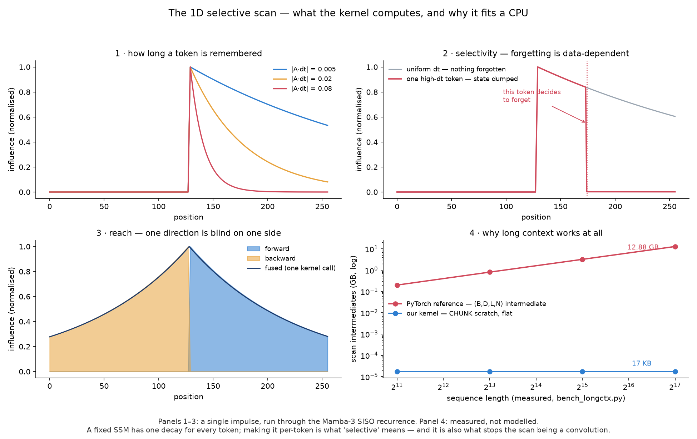
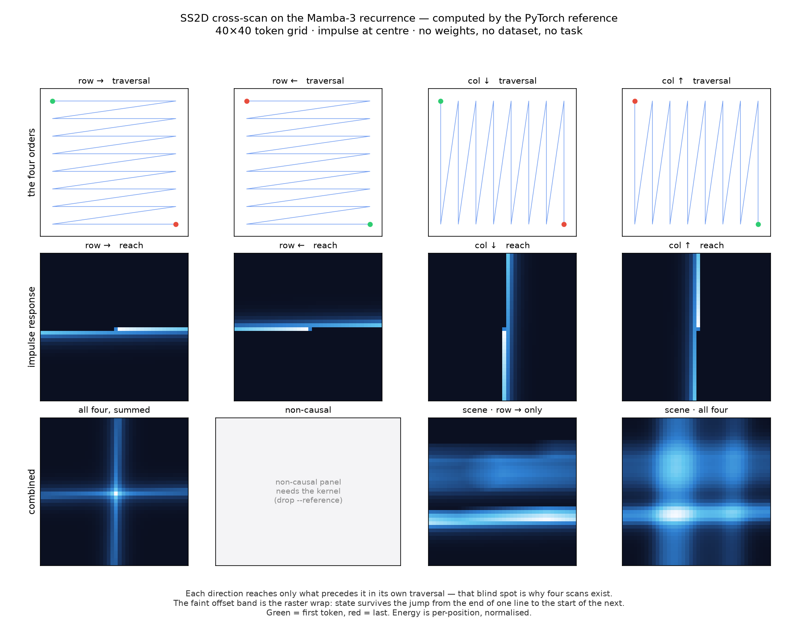
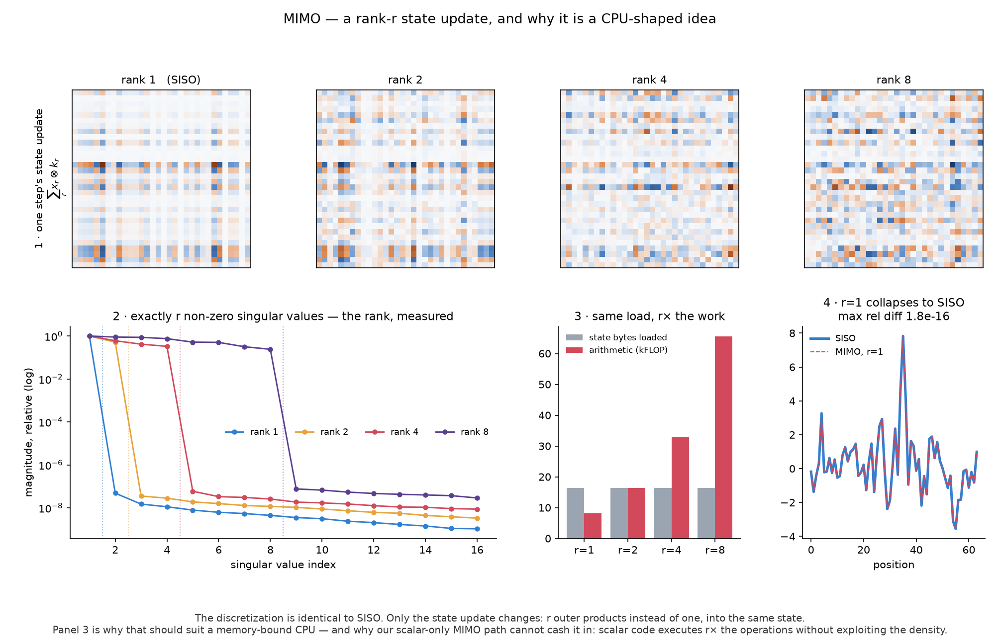

# Arm Scan — Arm-Optimized Selective Scan for the PyTorch Mamba Ecosystem

**Arm Create: AI Optimization Challenge 2026 — Cloud AI track**

[Run the kernel](RUNNING_THE_KERNEL.md) · [Current status](docs/project/STATUS.md) ·
[Project documentation](docs/project/README.md) · [Learn from first principles](docs/learn/00_START_HERE.md) ·
[Contributing](CONTRIBUTING.md)

State-space models run in **linear time with constant memory** — exactly what a CPU is good
at, and exactly what a transformer's growing KV cache is not. But in PyTorch, where these
models actually live, the selective scan at their core is **CUDA-only**. On CPU it falls back
to an unoptimized sequential loop, and `torch.compile` cannot rescue it: it cannot restructure
a sequential recurrence, and its compile time *grows with sequence length*.

This project ships **hand-written Arm/NEON selective-scan kernels in Rust**, exposed as
PyTorch custom ops — for both the deployed **Mamba-1** ecosystem and the newest
**[Mamba-3](https://arxiv.org/abs/2603.15569)** (ICLR 2026), whose official kernels are
Triton, TileLang and CuTe and have **no CPU path at all**.

## Project story

### Inspiration

Transformers reshaped AI, but their inference memory grows with context because they retain an
expanding key-value cache. State-space models such as Mamba offer a compelling alternative:
linear-time sequence processing with a fixed-size recurrent state.

That architecture should be a natural fit for CPUs. In practice, the selective scan at the
heart of Mamba remains heavily GPU-oriented. Existing PyTorch implementations of Mamba-1 fall
back to a slow sequential recurrence on CPU, while the official Mamba-3 implementations depend
on Triton, TileLang, or CuTe GPU kernels and provide no native CPU path.

We built Arm Scan around one question: **what could Mamba do if Arm64 cloud CPUs were treated
as a first-class AI target rather than a fallback?** Arm processors already power an expanding
share of cloud infrastructure, including AWS Graviton, but optimized AI inference still often
assumes CUDA and a GPU-specific software stack. That adds cost, operational complexity, and a
barrier to experimentation.

Arm Scan targets the **Cloud AI track** by closing that gap inside the PyTorch ecosystem. It is
not a standalone inference engine and does not require model conversion. Existing applications
and checkpoints can use an optimized Arm implementation with minimal code changes.

### What it does

Arm Scan is a PyTorch-native selective-scan engine built from safe Rust kernels, Arm NEON
vectorization, and multicore execution. It provides separate native implementations for
Mamba-1 and Mamba-3 and supports:

- Mamba-1 selective scan
- Mamba-3 SISO and rank-*r* MIMO
- Forward, reverse, bidirectional, and non-causal traversal
- Four-direction 2D cross-scans
- PyTorch and NumPy interfaces

We tested the library with three published pretrained checkpoints: Hugging Face
`mamba-130m-hf`, `state-spaces/mamba3-siso-187m`, and
`state-spaces/mamba3-mimo-187m`. We did **not** create, train, fine-tune, or alter their
weights. Arm Scan replaces or supplies the CPU scan path while leaving the pretrained weights
unchanged.

The headline measurements were collected on a dedicated 64-vCPU AWS Graviton4
`c8g.16xlarge`. They include 38.69× multicore scaling, up to 18.89× faster Mamba-3 SISO
scanning, 10.14× faster Mamba-1 prefill at 2,048 tokens, and up to 92.5× faster 2D Mamba-3
operator execution. Full measurements, baselines, and limitations are reported below.

### Why it belongs in Cloud AI

- **Arm64 cloud infrastructure:** the kernels are designed for server-class Arm processors and
  measured on Graviton4, rather than merely cross-compiled for Arm.
- **AI inference performance:** the project targets prefill and long-sequence processing, with
  operator, full-model, long-context, eager-PyTorch, and `torch.compile` comparisons.
- **Framework integration:** a PyTorch custom operation and a drop-in Hugging Face Mamba-1 patch
  let developers keep their existing framework, application code, and model format.
- **Production-oriented workflows:** the repository includes a versioned C ABI, deterministic
  golden vectors, reproducible benchmarks, platform packaging, and CI on Linux Arm64, Apple
  Silicon, and x86.

The project may eventually enable local and edge use cases, but those are not the basis of this
submission. Its implementation, measurements, integration, and developer workflow are centered
on **Arm64 cloud inference**.

### Why it matters

Arm Scan is enabling infrastructure rather than a language, healthcare, or financial model. It
creates another deployment option for Mamba-based inference when a GPU is unavailable,
unnecessary, or operationally undesirable. Potential uses include long records and biosignals,
financial and enterprise time series, private cloud services, CPU-based testing and continuous
integration, education, and long-sequence scientific computing.

It does not make every model suitable for every computer, and it does not replace GPUs where
their throughput is required. Its contribution is narrower and measurable: turning Mamba's weak
or missing CPU scan path into a native, validated Arm implementation that works with existing
PyTorch checkpoints. The included MRI pipeline demonstrates a 2D execution topology; it is
**not** a clinically validated medical product.

### How we built it

Arm Scan has four layers:

1. Safe Rust implementations of the Mamba-1 and Mamba-3 recurrences.
2. Arm NEON kernels for the expensive numerical operations.
3. Rayon parallelism across independent batches, channels, and heads.
4. A narrow C interface and Python integration that expose the kernels as PyTorch custom ops.

Mamba-1 and Mamba-3 have different mathematical state representations, so they use separate
kernels while sharing packaging, threading infrastructure, and correctness gates. Bidirectional
and 2D execution are expressed as traversal patterns over the scan primitive: flatten a grid in
four orders, run forward and reverse scans, then restore and combine the grid outputs.

Correctness was part of the design from the beginning. Validation includes ground truth captured
from the official Mamba-3 GPU kernels, an independent high-precision CPU reference, scalar and
NEON parity checks, real-C-ABI replay, traversal properties, thread determinism, real pretrained
models, and cross-platform continuous integration.

### Challenges and lessons

Mamba-3 had no authoritative CPU reference, so we had to capture official GPU ground truth and
independently reconstruct the recurrence. During that work we identified an upstream revision
issue that could silently corrupt forward-pass results on Blackwell GPUs, replaced
framework-dependent random inputs with deterministic test generation, and measured numerical
error floors instead of hiding normal NEON and BF16 differences.

Target hardware also changed our conclusions. A traversal-pair optimization that looked faster
on four-core x86 slightly regressed on 64-core Graviton4 because it exposed less parallel work.
That reinforced a central lesson: cloud optimization must be measured on the architecture where
it will run.

No official 2D Mamba-3 weights or authoritative public 2D implementation are available. We
therefore validate two independent operator formulations to approximately `2.99e-16`, while
making no downstream vision-accuracy claim. The current MIMO implementation is likewise framed
as a correctness result: both published model families run end to end, but MIMO still needs its
own cache-blocked NEON microkernel before it can become a speed result.

We are proud not only of the headline acceleration, but also of publishing negative and
surprising results, reproducibility limits, and claim boundaries. Trustworthy Cloud AI
infrastructure requires all of them.

### What's next

The highest-value next step is a fully fused 2D selective-scan kernel; Graviton4 measurements
show layout and dispatch overhead reaching 46.1% at real application shapes. We also plan to:

- Add cache blocking and NEON vectorization to rank-*r* MIMO
- Investigate BF16 state storage and SVE2 acceleration
- Expand prebuilt Arm64 wheels and cloud-platform coverage
- Integrate more Mamba-based PyTorch architectures
- Add containerized deployment paths for Arm cloud instances
- Evaluate 2D Mamba-3 with real vision checkpoints when authoritative weights appear

Arm Scan began as an attempt to accelerate one missing operation. It has become a reusable
foundation for running the broader PyTorch Mamba ecosystem natively on Arm64 servers—with
existing models, existing weights, and reproducible cloud-oriented workflows.

## Two kernels, one library

They are separate code, deliberately: Mamba-3's state is a **matrix per head** where Mamba-1's
is a **vector per channel**, and their tensor sets are disjoint. One entry point serving both
would be half-ignored on every call. They share threading, the C ABI, packaging, CI, and the
entire correctness harness.

| | Mamba-1 kernel | Mamba-3 kernel |
|---|---|---|
| Status | shipped, measured on Graviton4 | shipped, gated, measured on Graviton4 |
| Topologies | 1D · fused bidirectional · SS2D cross-scan | 1D · bidirectional · 2D, causal **and** non-causal |
| Drop-in | `arm_scan.patch()` for HF `transformers` Mamba | `arm_scan.mamba3_scan(...)` |
| Ground truth | vendored f64 reference | **captured from the official GPU kernels** |
| Runs real weights | `mamba-130m-hf`, **3.77×** end to end | `siso-187m` **98.05%** · `mimo-187m` **96.48%** argmax |

```python
import arm_scan
arm_scan.patch()                    # HF Mamba on CPU now runs the kernel
out = arm_scan.mamba3_scan(q, k, v, adt, dt, trap, q_bias, k_bias, angles=angles)
```

## What we claim, precisely

Prior art is real, and we checked it repo by repo rather than by search summary — the table
is published so a judge can see the search was done.

| Prior work | What it is | What it does not do |
|---|---|---|
| [llama.cpp](https://github.com/ggml-org/llama.cpp) | CPU `ssm_scan` for GGUF Mamba/Mamba-2 | Not PyTorch-callable; needs model conversion; 1D only |
| [`silvermpx/mamba-rs`](https://github.com/silvermpx/mamba-rs) | Mamba-3 SISO in Rust, CPU + CUDA | Standalone runtime, no PyTorch interop; x86/CUDA focus, **no Arm/NEON** |
| [`swfsql/burn-mamba`](https://github.com/swfsql/burn-mamba) | Mamba-1/2/3 for Burn, incl. bidirectional wrappers | Portable tensor ops by design — **no custom kernels**, no Arm tuning |
| [`kroggen/mamba.c`](https://github.com/kroggen/mamba.c) | Mamba/Mamba-2/Mamba-3 inference in pure C | Portable C, no NEON intrinsics; not PyTorch-callable |
| [VMamba](https://github.com/MzeroMiko/VMamba) / [2DMamba](https://arxiv.org/abs/2412.00678) | The SS2D cross-scan reference | **CUDA-only**; Mamba-1/2 lineage |
| [VNCT](https://arxiv.org/abs/2607.03589) | The 2D Mamba-3 architecture (ECCV 2026) | **Code unreleased**; GPU-only; no CPU or Arm path |

**To the best of our knowledge** this is: (1) the **first Arm/NEON selective scan exposed as a
PyTorch custom op** — a drop-in for existing checkpoints, no model conversion; (2) the **first
fast CPU SS2D cross-scan** on any architecture; (3) the **first PyTorch-callable,
NEON-optimised Mamba-3 scan**; and (4) the **first CPU implementation of a 2D Mamba-3**, in both
causal and non-causal form, plus the **causal-vs-non-causal comparison** — which nobody has
published for any Mamba generation on any hardware.

Claim (4) carries a caveat we state here rather than in a footnote: **there is no authoritative
2D oracle.** VNCT's code is unreleased and no 2D Mamba-3 weights exist, so our 2D work is
validated against our own reading of the operator — two independent algorithms agreeing to
2.99e-16 — which proves the kernel implements the reference, *not* that the reference implements
VNCT as its authors intended. **No accuracy claim is available for 2D and none is made.**

**We never claim** "first Mamba on CPU", "first Mamba-3 on CPU", or "first Mamba-3 in Rust" —
three projects above have those. Nor anything about bidirectional Mamba-3, which `burn-mamba`
ships.

## Correctness, and why it is unusually strong here

Mamba-3 has **no authoritative CPU reference** — upstream's module imports GPU kernels and asserts
if they are missing — so there was nothing to diff a CPU implementation against. We captured
ground truth directly from the official Triton kernels, driven by the real
`state-spaces/mamba3-siso-187m` checkpoint: 10 cases across 7 shapes, committed, replayable
with **numpy alone**. The GPU is never needed again.

Our reference reproduces those to **4.47 bf16 ULP** at tensor scale — and so do the Rust scalar
kernel, the cache-blocked kernel, and the PyTorch op, digit for digit. That is the floor bf16
output quantisation allows.

Four independent nets, all enforced in CI on arm64, macOS-arm64 and x86:

- golden vectors vs an f64 reference **and** an independent numpy re-derivation
- NEON ↔ scalar parity, and **bit-identical** output at any thread count
- goldens replayed through the **real C ABI**, not just the Rust tests
- `reverse` defined as an equivalence (flip → scan → flip) and checked as one

Two findings we document rather than bury: upstream's released `mamba-ssm` wheel predates a fix
for **silent forward-pass corruption on Blackwell**, so capturing through it would have
validated everything downstream against garbage; and the golden input draws had to move off
`torch.Generator` *and then* off float32 transcendentals, because neither reproduces across
versions or across architectures.

## Numerics, disclosed

NEON `exp` polynomials and FMA reassociation mean results match the reference to fp32
tolerance, not bit-exactly. Every golden records its own error floor and every change is gated
against it. Patched HF mamba-130m produces **token-identical** greedy output.

## Run Arm Scan

> **New here?** Follow [`RUNNING_THE_KERNEL.md`](RUNNING_THE_KERNEL.md) for the complete
> fresh-machine guide: prerequisites, Arm64 setup, building, validation, Python usage,
> real-model tests, benchmarking, AWS Graviton instructions, and troubleshooting.

For an existing Linux or macOS development environment, the shortest validation path is:

```bash
git clone https://github.com/AdityaP9116/Arm-Scan && cd Arm-Scan
make validate      # kernel + SS2D + diffusion gates, ~5 min, no data, no AWS account
make test-mamba3   # all 7 Mamba-3 gates (SISO, MIMO, 2D causal + non-causal), ~20s
```

Running the real 187M model on your CPU (downloads ~357 MB):

```bash
make test-mamba3-model    # logits vs the official GPU model, SISO and MIMO
python bench/bench_mamba3_lm.py --quick
python bench/bench_mamba3_lm.py --model state-spaces/mamba3-mimo-187m --quick
```

Runs on AWS Graviton, Oracle Ampere, Raspberry Pi 5 and Apple Silicon. Correctness validation
never needs credentials.

## Status — honestly

**Done:** both kernels, every correctness gate, the PyTorch integration, wheels, CI across three
platforms — and **both published Mamba-3 families running end to end on CPU**
(`apps/mamba3_lm/`): `mamba3-siso-187m` at **98.05%** argmax agreement and the rank-4
`mamba3-mimo-187m` at **96.48%**. The SISO mixer matches the official block to 1.36 bf16 ULP.

That floor is worth a sentence, because it surprised us: the official kernel is
`triton.autotune`d, so it picks its config by timing candidates at first call. Two runs of the
**official model** on the same GPU with the same seed disagree on up to 5/256 tokens, while two
forward passes inside one process are bit-identical. Our agreement sits inside that band, so
the gate is written against the measured floor rather than an unreachable 100%.

## Measured on Graviton4

**`c8g.16xlarge` — Neoverse-V2, 64 vCPU, Ubuntu 24.04, torch 2.13.0, quiesced.** These replace
every earlier figure; anything measured on x86 or the shared 4-core CI runner was provisional
by this project's own rules. Raw JSON in [`bench/results/`](bench/results/).

**Core scaling** (B=1 D=1536 L=512 N=16) — near-perfect to 8 cores, then an honest decay:

| threads | 1 | 2 | 4 | 8 | 16 | 32 | 64 |
|---|---|---|---|---|---|---|---|
| kernel | 17.55 ms | 8.76 ms | 4.40 ms | 2.23 ms | 1.22 ms | 0.74 ms | **0.45 ms** |
| speedup | 1.00× | 2.00× | 3.99× | 7.86× | 14.44× | 23.58× | **38.69×** |
| efficiency | 100% | 100.2% | 99.8% | 98.3% | 90.3% | 73.7% | 60.4% |

**Ladder:** scalar 1.447 ms → NEON 342 µs (**4.23×**) → +rayon 55.5 µs (**6.17×**) = **26×**.

**Where the time goes** — stable to within 0.5% across every shape tested:

| exp | discretize | recurrence | epilogue | projection | transpose |
|---|---|---|---|---|---|
| **47.7–48.2%** | 24.0–24.4% | 14.2–14.3% | 6.7–7.9% | 5.5–6.8% | **0.0–0.1%** |

Pass A is **~72% of runtime**, which is the two-pass design's premise measured rather than
asserted. It also names the next lever — `exp` (bf16 storage, SVE2 `FEXPA`) — and rules one
out: the transpose is free.

**The real 187M models, end to end on CPU:**

| | L=128 | L=256 | L=512 | L=1024 |
|---|---|---|---|---|
| `siso-187m` vs the recurrence | 5.03× | 9.05× | 13.54× | **18.89×** |
| …vs `torch.compile` | 1.64× | 3.05× | — | — |
| …`torch.compile` **compile time** | 48.9 s | 88.2 s | — | — |
| …tokens/s | 957 | 1,802 | 2,742 | **3,820** |

`mimo-187m` also runs end to end — see [MIMO](#mimo-a-correctness-result-not-a-speed-one)
below, where the honest framing takes a paragraph rather than a table row.

**Drop-in, on a stock Hugging Face model** — one `arm_scan.patch()` call, mamba-130m:

| prompt | prefill | end to end |
|---|---|---|
| 128 tok | 275.9 → **175.5 ms** (1.57×) | 1.13× |
| 2048 tok | 3634.5 → **358.3 ms** (**10.14×**) | **3.77×** |

Decode is ~1× and that is expected, not a miss: single-token decode runs
`mamba_selective_state_update`, which we deliberately leave to upstream.

### What the 1D scan actually computes



The word doing the work in "selective scan" is **selective**. An SSM before Mamba had one fixed
decay for every token, so its memory behaved the same no matter what it read. Making the step
size `dt` a function of the input makes `α = exp(dt·A)` per-token — so the model can decide, at
each position, whether to hold what it has or dump it and start fresh.

Panel 2 is that decision, drawn: a single high-`dt` token wipes the state, and everything before
it is forgotten. **That is also precisely what stops the scan being a convolution**, and so what
makes a hand-written kernel necessary at all — see [§2](docs/learn/02_mamba_and_selective_scan.md).

Panel 4 is the constant-memory claim on measured numbers: **12.88 GB of intermediates against
~17 KB of chunk scratch** at L=131,072.

**2D Mamba-3** — as far as we can tell the first CPU implementation of any 2D Mamba-3.
`arm_scan.ss2d_scan_mamba3` runs the four-direction cross-scan on the Mamba-3 recurrence as pure
layout over `mamba3_scan_pair` — **no new kernel code**:

| grid | 14×14 (196 tok) | 28×28 (784) | 56×56 (3136) |
|---|---|---|---|
| kernel | 3.32 ms | 5.15 ms | **9.08 ms** |
| vs the recurrence | 17.7× | 41.9× | **92.5×** |
| vs `torch.compile` | 14.25× | *cannot compile* | *cannot compile* |

**Correctness and throughput only**: no 2D Mamba-3 weights have ever been published, so no
accuracy claim is available and we do not make one.

### What the cross-scan actually computes



```bash
make viz          # -> bench/results/ss2d_scans.png
```

A scan is an operator, so the honest way to show one is its **impulse response**: put a 1 in a
single cell, run it, and look at where the energy goes. **No weights, no dataset, no downstream
task** — which is just as well, since no 2D Mamba-3 weights exist to build a segmentation demo
from.

Each direction reaches only what precedes it *in its own traversal*: the row scans smear
horizontally, the column scans vertically, and each is blind on one side. Summing all four is
what closes those blind spots — visible in the cross that the combined panel forms, and in the
scene panels where one direction leaves a directional smear and four do not.

The faint offset band is worth a look: both orderings are plain **raster** scans rather than
boustrophedon, so state survives the jump from the end of one line to the start of the next.

`q`, `k` and the RoPE angles are held constant so `q·k` is uniform; what remains is the
propagation envelope rather than noise in their dot products. The kernel is unmodified —
only its inputs are chosen to make one property legible. Pass `--reference` to render the same
figure through the PyTorch reference on a clone with no cdylib built.

The **causal-vs-non-causal comparison** — which nobody has published for any Mamba generation —
now measured: dropping causality costs **~2× in 1D** (1.61–3.19×) but only **1.14–1.55× in 2D**,
because the four-direction cross-scan already runs both directions. It needed no new kernel,
because the decay factorises. The O(L²) dense form reproduces the O(L) kernel to **2.99e-16**
and the crossover sits at ~784 tokens.

### Two results that reversed on real hardware

Published because they contradict what x86 said, and because the second one is a decision this
project now has to act on.

**The SS2D traversal-pair rewrite regresses at 64 cores.** x86 measured 1.77–1.82×; Graviton
measures **0.96× geomean** on the production shapes. The cause is structural and was predicted
in [`bench/GRAVITON_SESSION.md`](bench/GRAVITON_SESSION.md) before the session: the pair form
halves the rayon rows — two batches per call instead of four — which costs nothing on 4 cores
and a great deal on 64. `SS2DBlock._forward_legacy` was retained for exactly this and now earns
its keep.

**The P1-7 verdict flips.** Worst real-shape overhead is **46.1%** here against 7.2–13.8% on
x86, so a fully fused `selective_scan_2d` is **justified** under the 15% rule rather than
rejected. That is the highest-value remaining kernel work.

### Open, and reported rather than explained

`bench_mamba3.py` at the 187M shape runs **L=256 in 6.15 ms and L=1024 in 5.05 ms** — four
times the tokens in less time. It reproduced at `reps=15 warmup=5`, so it is not a warm-up
artifact. We do not have an explanation.

## MIMO: a correctness result, not a speed one

Mamba-3's second published family uses a **rank-*r*** state update where SISO's is rank-1.
Both `state-spaces` families now run end to end on Arm CPU through our kernel, and **that
coverage — not a speedup — is what Path B claims.**



The discretization is *identical* to SISO — same `α`, same `γ`, same forward-looking scale. Only
the state update changes: **`r` outer products absorbed into the same state instead of one.**

Panel 2 is the panel that proves rather than illustrates: a sum of `r` outer products has
**exactly `r` non-zero singular values**, and the spectrum drops eight orders of magnitude right
after index `r`. Panel 4 is the structural check — with the rotation removed, a rank-1 MIMO scan
*is* a SISO scan, to **1.8e-16**. (CI runs that same comparison kernel-to-kernel in
`tests/check_mamba3_mimo_op.py`.)

Panel 3 is the argument, and the disappointment. The state loaded per step is the **same size**
at every rank while the arithmetic scales with `r` — higher arithmetic intensity, which is what
a memory-bound CPU wants. Our MIMO path is scalar-only, so it executes `r`× the operations
without exploiting that density, and the advantage never materialises.

**What it delivers.** These are the tightest numbers in the project:

| Gate | MIMO | SISO, for scale |
|---|---|---|
| Reference vs the official **TileLang** kernel | **2.40 bf16 ULP** | 4.47 |
| Rust kernel **through the real C ABI** | **1.90 bf16 ULP** | — |
| `mamba3-mimo-187m` argmax agreement | **96.48%** | 98.05% |
| …against the reference-vs-**itself** floor | 95.31% | 98.83% |
| rank-1 MIMO collapses to SISO | **2.41e-07** | — |

Two of those deserve reading twice. The Rust kernel sits **closer to the official GPU kernel
than our own PyTorch reference does** (1.90 vs 2.40 ULP). And at 96.48% against a 95.31% floor,
**we agree with the reference more closely than the reference agrees with itself** across
processes — the official kernel is `triton.autotune`d and so is not reproducible run to run.

Setting *r*=1 reproduces the SISO kernel to 2.41e-07, which is a structural proof that the
generalisation is right rather than merely close.

**What it does not deliver: speed.** `mamba3/mimo.rs` is the **scalar path only** — no NEON, no
cache blocking — and dispatch routes MIMO before the backend match so it says so rather than
silently substituting. Measured on Graviton4:

| | L=128 | L=512 | L=1024 |
|---|---|---|---|
| MIMO | 171.95 ms | 465.58 ms | 919.70 ms |
| SISO | 133.76 ms | 186.74 ms | 268.09 ms |
| **MIMO is slower by** | 1.29× | 2.49× | **3.43×** |

Its ratio against the PyTorch baseline reaches 31–56×, and **we do not quote that number**,
because the MIMO reference is itself ~10× slower than the SISO reference (50,748 ms vs 5,064 ms
at L=1024). That ratio measures a pathological baseline, not a fast kernel.

**Why the gap exists, and why it is the opposite of a fundamental limit.** MIMO loads the same
state as SISO and does *r*× more arithmetic with it — roughly *r*× the arithmetic intensity.
That is precisely the regime a memory-bound CPU is weakest in and should benefit most from. A
scalar implementation cannot exploit arithmetic density at all; it simply executes *r*× more
scalar operations, which converts MIMO's theoretical advantage into a straight slowdown.

The work an optimised kernel would vectorise — a rank-*r* outer-product accumulation and an
*r*×*r* diagonal contraction — is dense, regular and register-friendly, i.e. close to an ideal
NEON target. **We have not built it, so the arithmetic-intensity argument for MIMO on CPU
remains a prediction. The table above is the gap such a kernel would have to close.**

## Where to look

| | |
|---|---|
| [`RUNNING_THE_KERNEL.md`](./RUNNING_THE_KERNEL.md) | Fresh-machine setup, build, validation, usage, benchmarking, and troubleshooting |
| [`docs/project/STATUS.md`](./docs/project/STATUS.md) | Current capabilities, limitations, and highest-value remaining work |
| [`docs/project/MAMBA3_IMPLEMENTATION_PLAN.md`](./docs/project/MAMBA3_IMPLEMENTATION_PLAN.md) | Current plan: stages, prior art, claims policy |
| [`docs/project/THREE_PATHS_INTEGRATION.md`](./docs/project/THREE_PATHS_INTEGRATION.md) | The three demonstrations, scoped: what each can and cannot claim |
| [`docs/project/MAMBA3_KERNEL_WORKPLAN.md`](./docs/project/MAMBA3_KERNEL_WORKPLAN.md) | File-by-file execution, and the audit of the existing kernel |
| [`docs/project/PROJECT_CONCEPT.md`](./docs/project/PROJECT_CONCEPT.md) | Decision log — what was chosen, what was rejected, why |
| [`docs/`](./docs/README.md) | Documentation hub: current design, learning path, roadmaps, and history |
| [`CONTRIBUTING.md`](./CONTRIBUTING.md) | Correctness, safety, benchmarking, and contribution rules |
| [`apps/mri_diffusion/`](./apps/mri_diffusion/) | SS2D-Mamba diffusion MRI — **demoted, still CI-gated** ([plan](./docs/archive/MRI_DIFFUSION_IMPLEMENTATION_PLAN.md)) |

## License

MIT — see [`LICENSE`](./LICENSE) (also set in the repository About sidebar, per contest rules).
